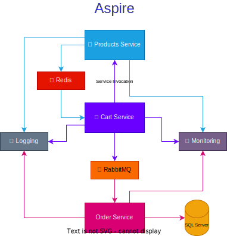

# Aspire Recipes

.NET 8 Aspire

- [x] Logging
* `Application & Components logging`

- [x] Monitoring
* `Tracing`

- [x] Service Discovery / Invocation
* > `Cart Service` -> `Products Service`
* **Refer:** [Service Invocation](./CartService/Controllers/CartController.cs)

- [x] Caching
* > `Products Service`, caches `Product Details` for 5 seconds
* **Refer:** [Caching](./ProductsService/Controllers/ProductsController.cs)

- [x] Message Queue
* > `Cart Service` -> `Order Service`
* **Refer:** [Publisher](./CartService/Controllers/CartController.cs) and [Receiver](./OrderService/Listeners/OrderListener.cs)

- [x] Database
- [ ] Deployment

## Recipe

